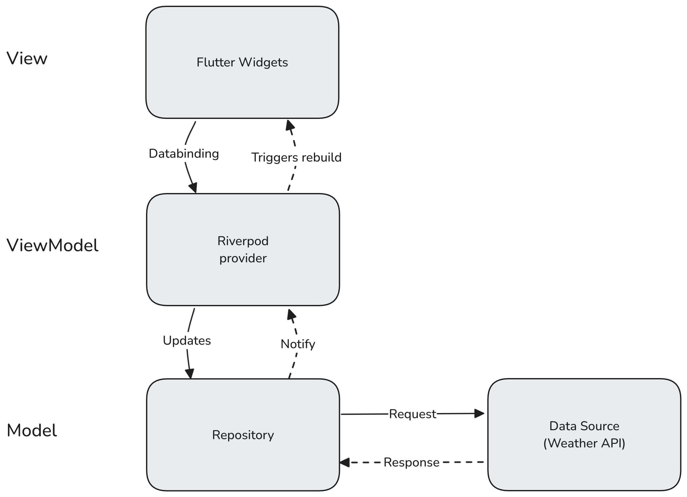

<h1 align="center">Flutter weather app 🌥️☔☀️</h1>

This is an example weather app made with Flutter using [Riverpod](https://riverpod.dev) as a state management solution.
The app is using [https://open-meteo.com](https://open-meteo.com) as a weather API.

## Setup
```bash
# Install flutter packages
flutter pub get

# Run code generation to generate all needed classes
flutter dart run build_runner watch -d
```

## Features
The following technical features are implemented in the app:
1. Search with caching and debouncing
2. API request caching
3. State management with Riverpod
4. Flutter Material3 design system
5. Persistent state through SharedPreferences
6. Light and dark theme

## Tech stack
* [Flutter](https://flutter.dev/)
* [Riverpod](https://riverpod.dev/) with code generation for state management, DI and caching
* [Freezed](https://pub.dev/packages/freezed) for the data models to generate essential methods like toString, ==, hashCode and to handle de/serialization of the data
* [Dio](https://pub.dev/packages/dio) as an HTTP client
* [Flutter hooks](https://pub.dev/packages/flutter_hooks) for reusable widget logic
* [Shared Preferences](https://pub.dev/packages/shared_preferences) for persistent storage
* [Flutter native splash](https://pub.dev/packages/flutter_native_splash) to customize the splash screen

## Architecture
The app follows a Model-View-ViewModel (MVVM) architectural pattern with a **layer-first** project structure.

The application is split into three separate layers:

1. **Presentation layer**: Flutter widgets and Riverpod providers (ViewModels)
2. **Domain layer**: Data models with business logic
3. **Data layer**: Repositories to access the data

> [!NOTE]
> For more complex projects, an additional application/service layer can be introduced between the presentation and domain layers to handle the business logic separately, rather than embedding it within the models.

The Riverpod providers act as ViewModels to establish data bindings and update the UI as needed. The providers retrieve their data from repositories, making the repositories easily replaceable and ensuring a clear separation of concerns.




### Project Structure

```plaintext
weather_app/
├── android/
├── ios/
├── lib/
│   ├── main.dart          # Entry point of the application
│   ├── ui
│   │   ├── pages/         # Main pages of the app
│   │   ├── views/         # View components that are included on the pages
│   │   └── widgets/       # Reusable widgets
│   ├── provider/          # Riverpod provider managing the state of the app
│   ├── models/            # Data models of the app
│   └── repositories/      # Data access through API calls
├── assets/
├── test/
├── pubspec.yaml
└── README.md
```